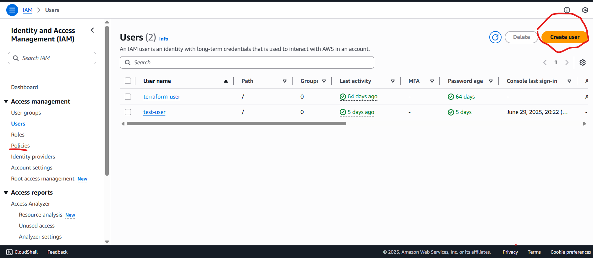

## IAM

Used to perform authentication and authorization.

We make IAM users and give them access accordingly so to avoid any consequences, also create groups like developers etc. As a DevOps Engineer team you are also IAM user and not root user.

Go to Users Group and create user, you can add users later on as well and their permissions as well, one of the benefits of groups is you don’t have to do manually for each user as in big organization there can be multiple users of same team with same access.

