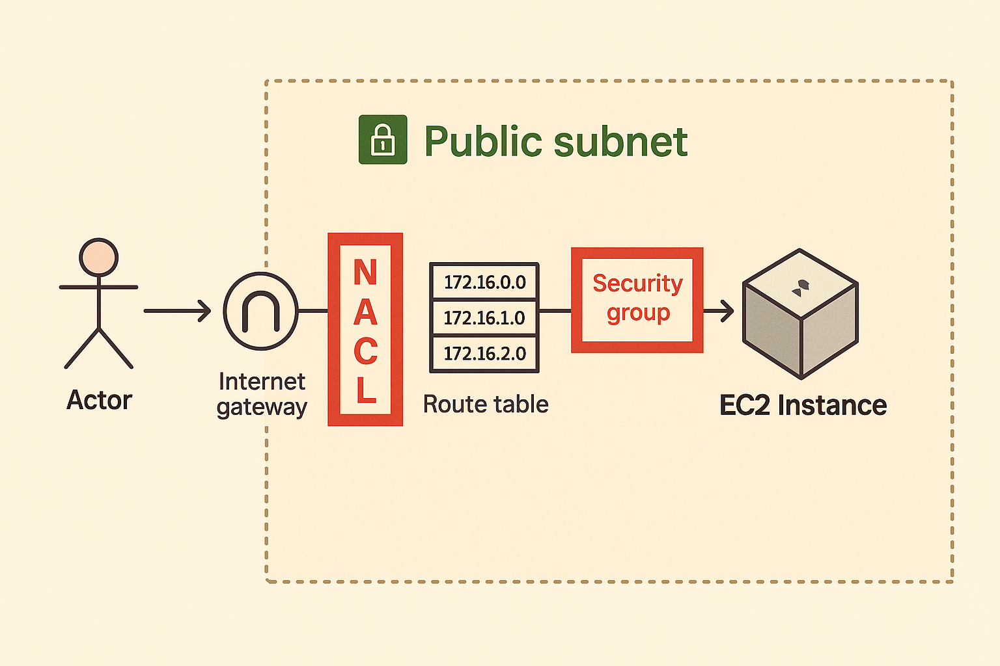
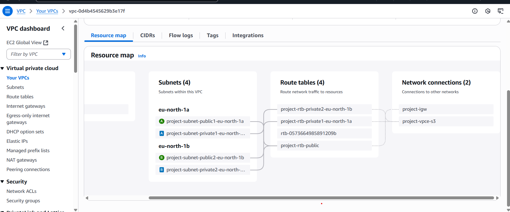
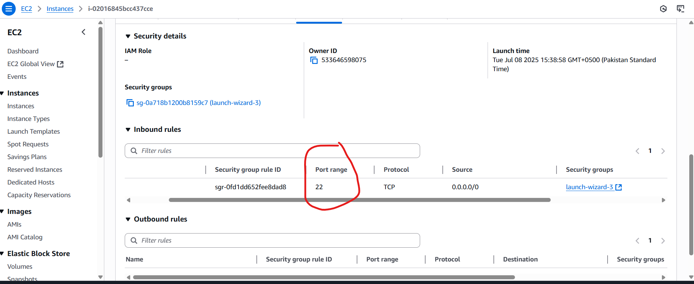
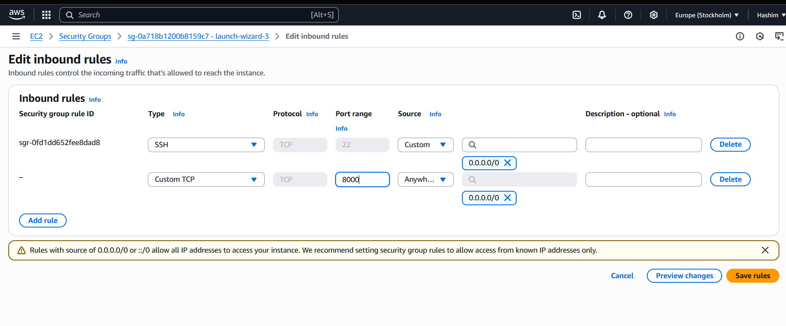
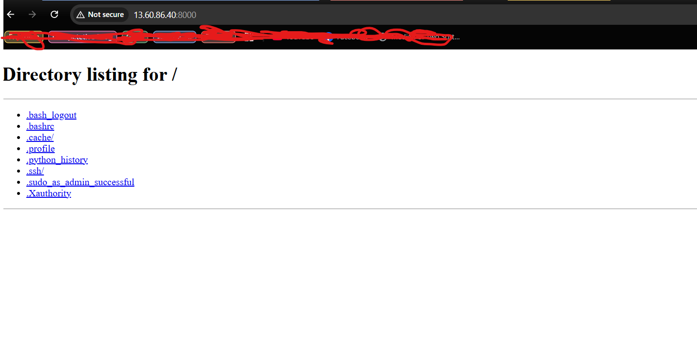

## Secuirity Group and NACL

NACL is basically acting as firewall to private subnets inside VPC. 

If for example bypass the NACL or not implemented then as a DevOps engineer you can add more security at ec2 instances which are called security groups.

In AWS security is shared responsibility. Like AWS is providing security groups, NACL etc. but DevOps engineers also has to do the work and this is where load balancers etc. come in picture.

NACL and security groups are very critical because of this very reason that is they act as a last point of security in your AWS account just before the user request reads the application, if this is user and this is where the application is it has to travel a long path right the request has to travel a long path within the VPC it goes through multiple components but when it reach here before this point the last point of security is served by security groups and NACL.

Inbound Traffic **coming into** the instance  e.g. Allow SSH (port 22) from your IP              
Outbound Traffic **leaving from** the instance e.g. Allow all traffic to the internet (0.0.0.0/0) 

Be default, outbound traffic allowed by aws except port 25, but deny all inbound.
port 25 is mailing service.

**NACL**

A **Network ACL** is a set of rules that controls traffic **to and from a subnet**.

- **Attached to subnets**
- Works at the **subnet level**
- **Stateless** – You must add **both** inbound and outbound rules.

So its upto us, to use Security groups only or Security groups + NACL, as security groups only for allowing but NACL is for allowing and denying as well.

Key Differences
| Feature          | Security Group | NACL         |
| ---------------- | -------------- | ------------ |
| Level            | Instance       | Subnet       |
| Stateful         | ✅ Yes          | ❌ No         |
| Rule Type        | Allow only     | Allow & Deny |
| Default Behavior | Deny all       | Allow all    |

**Now Lets Perform Practical Example**

I will create VPC and provide ip range, and as security is shared responsibility so aws will by default create internet gateway, default NACL, and route table, and I also create ec2 instance and add security group.
And then we will play with NACL and security group configurations and see how traffic flows etc.

So basic architect of project will be

**Creating VPC**

In Default security group only port 22 allowed but it is clear from Nacl, like traffic coming from nacl but blocked at Security group. you can goto the Vpc you created and check it.

Now Let's add inbound rules at Security group

Now, It is accessible.

And as a DevOps Engineer you can got Vpc and remove that incoming traffic alloweness as well, so Security control is in your hands.
