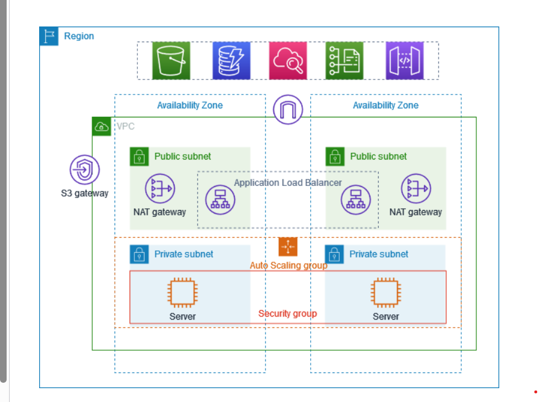
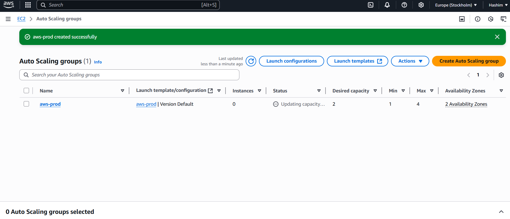

# AWS PROJECT

### Overview
VPC with private and public subnets with two availability zones in production
Each public subnet contains a NAT gateway and laod balancer node.
The servers run in private subnets, are launched and terminated by using an AutoScaling group(making replicas to handle burden etc.),
and recieve traffic from load balancer(sending requests to mange traffic).
Servers connect to internet using NAT gateway.
A bastion host is a special-purpose computer, typically a server, that acts as a secure gateway between a public network (like the internet) and a private network.

### Let's Start the Project

**Steps**
-> Create VPC
-> Create Ec2 instances via AutoScaling Groups

-> Create Bastion host which will act as mediator between private and public subnets
