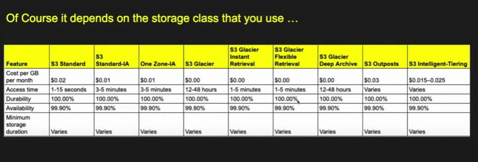

# AWS S3 Tutorial

Amazon S3 is an object storage service used to **store** and **retrieve** any amount of data at any time. It stores data as **objects** within **buckets**. Each object consists of:

- Data (the file content)
- Metadata (key-value pairs)
- A unique identifier (key)
---
AWS gives 99.999..(11 9's) gurantee that object will not be deleted
It is cost effective and also depends on the class of storage.

## Use Cases

- Static website hosting  
- Backup and restore  
- Data lakes and analytics  
- Software delivery (e.g., storing binaries)  
- Media storage (images, videos, etc.)

---

## AWS CLI Setup

### Installation (macOS / Linux / Windows WSL)
```bash
pip install awscli --upgrade --user

Configure AWS CLI

aws configure

You will be prompted for:

AWS Access Key ID

AWS Secret Access Key

Default region (e.g., us-east-1)

Default output format (e.g., json)

Create a Bucket
aws s3 mb s3://my-first-bucket

Security and Permissions
Bucket Policy Example: Make Objects Public
{
  "Version": "2012-10-17",
  "Statement": [{
    "Sid": "PublicReadGetObject",
    "Effect": "Allow",
    "Principal": "*",
    "Action": "s3:GetObject",
    "Resource": "arn:aws:s3:::my-first-bucket/*"
  }]
}

```
## Security
S3 provides bucket policies, access control, and encryption settings are appropiately configured.

## Permissions
Using bucket permissions you can limit access to specific buckets
Like if you want that specific buckets don't have access to others you can set it by going
to that bucket permissions and then edit the policy and add the policeis in form of json.
Add statement and to exlude yourself from not having access to bucket click the Add condition and select principalARN at condition key and operator as not equals to.
 
 Like this:
```bash
{
  "Version": "2012-10-17",
  "Id": "RestrictBucketToIAMUsersOnly",
  "Statement": [
    {
      "Sid": "AllowOwnerOnlyAccess",
      "Effect": "Deny",
      "Principal": "*",
      "Action": "s3:*",
      "Resource": [
        "arn:aws:s3:::your-bucket-name/*",
        "arn:aws:s3:::your-bucket-name"
      ],
      "Condition": {
        "StringNotEquals": {
          "aws:PrincipalArn": "arn:aws:iam::AWS_ACCOUNT_ID:root"
        }
      }
    }
  ]
}
```
